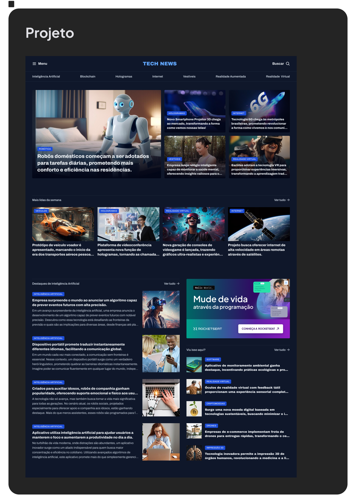

<h1 style="text-align:center"> Projeto portal de notícias </h1>

  <a href="#-tecnologias">Tecnologias</a>&nbsp;&nbsp;&nbsp;|&nbsp;&nbsp;&nbsp;
  <a href="#-projeto">Projeto</a>&nbsp;&nbsp;&nbsp;|&nbsp;&nbsp;&nbsp;
  <a href="#-layout">Layout</a>&nbsp;&nbsp;&nbsp;|&nbsp;&nbsp;&nbsp;
  <a href="#memo-licença">Licença</a>

  

 

  

## 🚀 Tecnologias

Esse projeto foi desenvolvido com as seguintes tecnologias:

- HTML e CSS
- Git e Github
- Figma

## 💻 Projeto

Cada projeto é um novo ingrediente no aprendizado — dessa vez, uma página de receitas feita com HTML e CSS!

- [Acesse o projeto finalizado, online](https://github.com/HudsonToledo/Projeto_portal_noticias)

## 🔖 Layout

Você pode visualizar o layout do projeto através [DESSE LINK](https://www.figma.com/design/4NTdc1wfGalaSW4m9hoZuf/Portal-de-not%C3%ADcias--Community-?node-id=3-809&t=EeGaV0RQZvWaPpxs-0). É necessário ter conta no [Figma](https://figma.com) para acessá-lo.

## :memo: Licença

Esse projeto está sob a licença MIT.

---

Feito com ♥ by Hudson Toledo